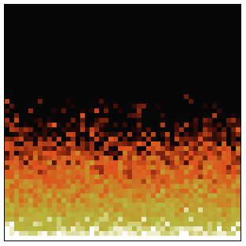

The Doom fire simulation, based on Filipe Deschamps's tutorial here: https://www.youtube.com/watch?v=fxm8cadCqbs.

Build with:

    elm make src/Main.elm --output app.js

then just open the `app.html` file in a browser.
